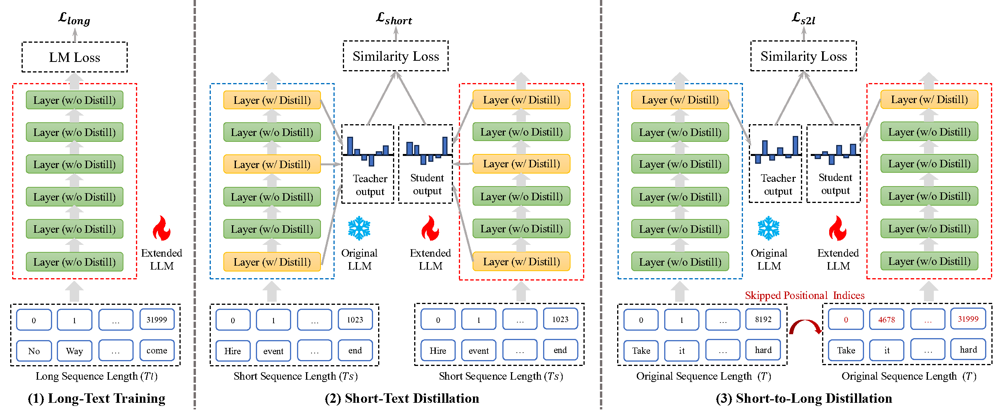
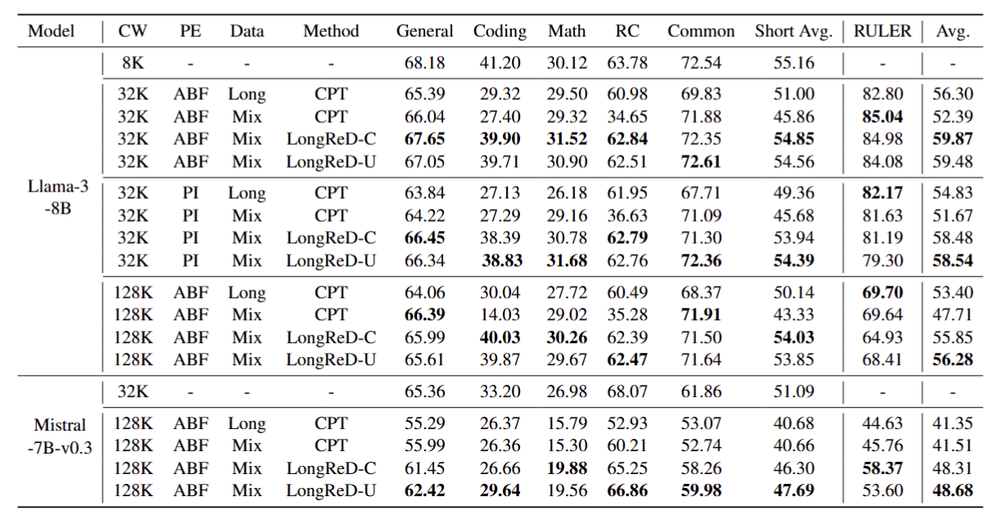

# LongReD: Mitigating Short-Text Degradation of Long-Context LLMs via Restoration Distillation

## Overview
* We are the first to systematically analyze the reasons for the short-text ability degradation in long-context models: 
  * Distribution Drift
  * Catastrophic Forgetting
* We propose **LongReD**, which mitigates the short-text performance decline via simulating the original distributions before extension.
  * Long-Text Training
  * Short-Text Distillation
  * Short-to-Long Distillation
* Experiment results accross 17 datasets covering 6 capacities demonstrate that LongReD can achieve better short-text performances while keeping comparable or better long-context performances.



## Installation
The code is built based on EasyContext framework. For runing the code, you should first install packages from requirements.txt
```bash
pip install -r requirements.txt
```

## Training
We provide four training scripts for LongReD-C, LongReD-U, long+cpt, and mix+cpt for Llama-3-8B to extend its context window to 32K.

You can run the following scripts:

```bash
bash ./scripts/train_longred_cream.sh
bash ./scripts/train_longred_uniform.sh
bash ./scripts/train_long_cpt.sh
bash ./scripts/train_mix_cpt.sh
```

## Results





```
@article{dong2025longred,
  title={LongReD: Mitigating Short-Text Degradation of Long-Context Large Language Models via Restoration Distillation},
  author={Dong, Zican and Li, Junyi and Jiang, Jinhao and Xu, Mingyu and Zhao, Wayne Xin and Wang, Bingning and Chen, Weipeng},
  journal={arXiv preprint arXiv:2502.07365},
  year={2025}
}
```